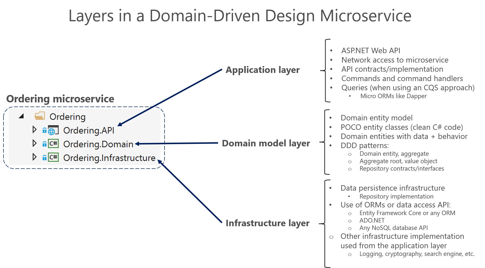
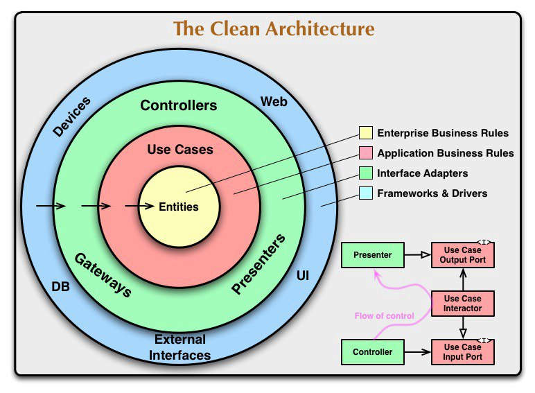
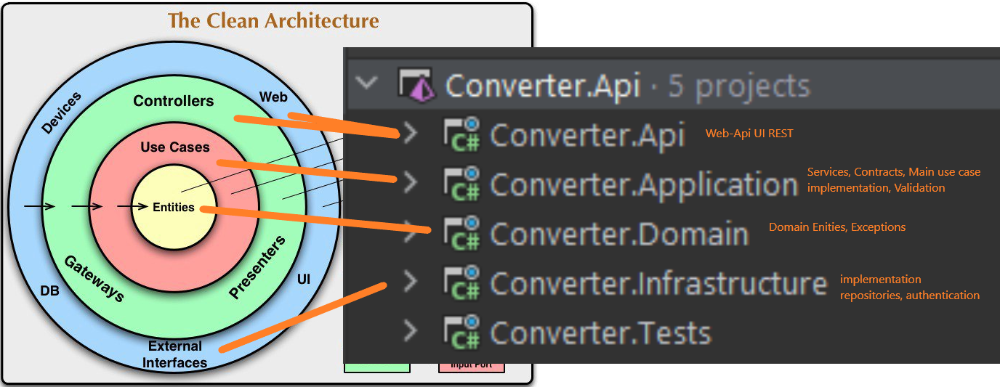

# Nexus Currency Converter
Simple REST currency converter service. Tech: .NET6, ASP.NET WebApi, DDD, JWT Authorisation
## Repository structure
- **[src]** - Source code
- **[keys]** - RSA keys
- **[requests]** - Postman collection
- **[assets]** - Images
## Project structure
- **Converter.Domain** - Application domain model. Include base entity.
- **Converter.Application** - Application use cases. Conversion, Localization, Login, Registration, Validation, Contracts. Implementation base use cases
- **Converter.Infrastructure** - Application infrastructure. Implementation contracts, repositories, authentication
- **Converter.Api** - Application UI. ASP.NET Web Api.
##Notes
### Description architecture

Microsoft article: https://learn.microsoft.com/en-us/dotnet/architecture/microservices/microservice-ddd-cqrs-patterns/ddd-oriented-microservice

Clean Architecture

Project Architecture

### Manual
1. Default user: login: **admin**, password: **password**
2. Authentication: **Bearer Token**
3. Supported currencies pairs with localization (hardcode in memory): 
   1. usd:chf
   2. usd:uah
   3. usd:eur
   4. usd:rub
   5. usd:cad
   6. usd:cny
   7. usd:jpy
   8. usd:inr
4. Examples in **[requests]**
